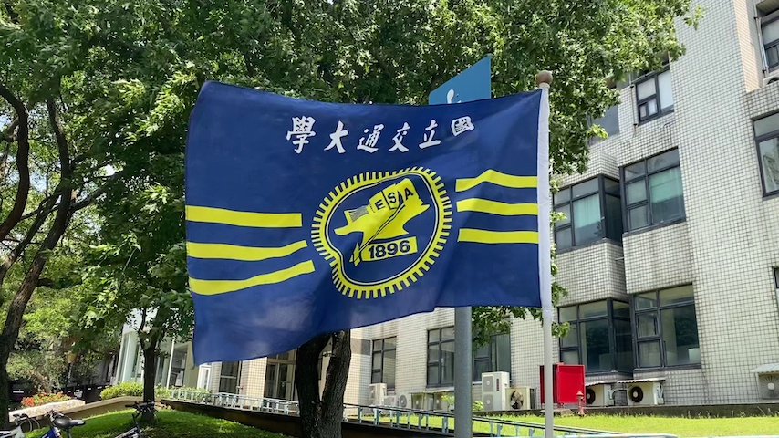
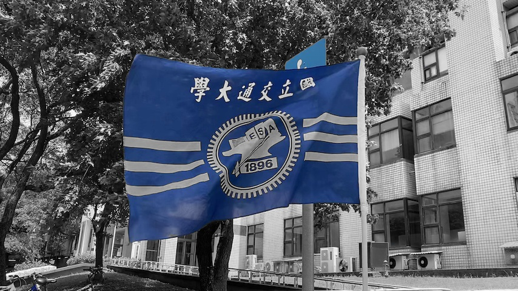

# Lab01
## 1.Filter all color except "Blue"
- Before
    
- After
    
## 2.Scale pictures by bilinear alg. and NN interpolation
- Before
    
- After
    
    

To output the results of bilinear alg  & NN-interpolation
```
%python lab2a.py 
```
If you would like to enter some customized scale parameter
```
%python lab2b.py 
```
and then enter some number sequentially. 
For example,
```
%2 
```


