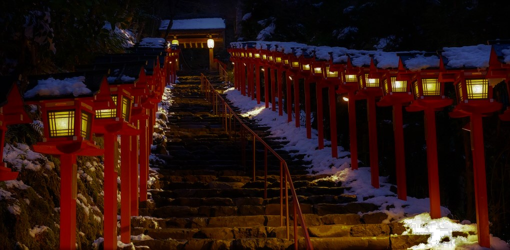
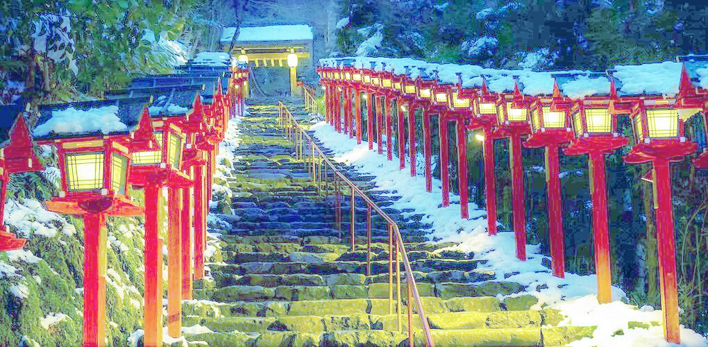
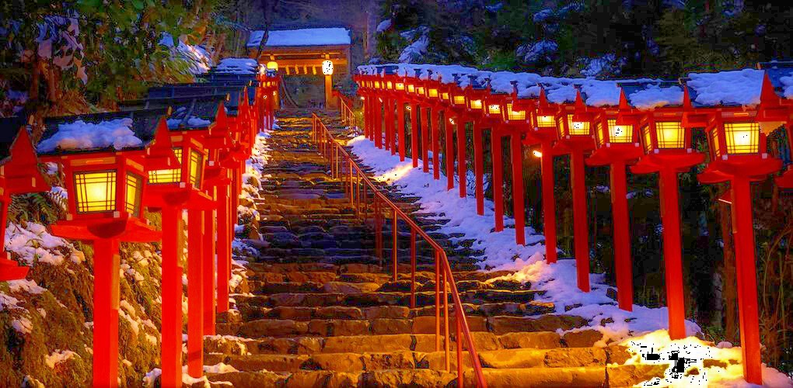
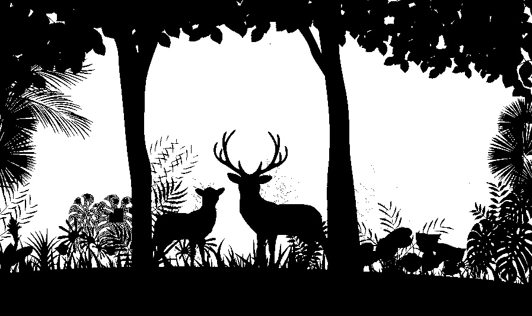

# Lab02
## 1. Histogram Equalization
- Before
    
- HE on RGB field
    
```
%python lab1_a.py
```
- HE on HSV field
    

## 2. Otsu thereshould
- Before
    
- After
    

I calculated the threshold by writing tool script.
```
%python lab2_tool.py
```
Apply Otsu threshold:
```
%python lab2.py 
```