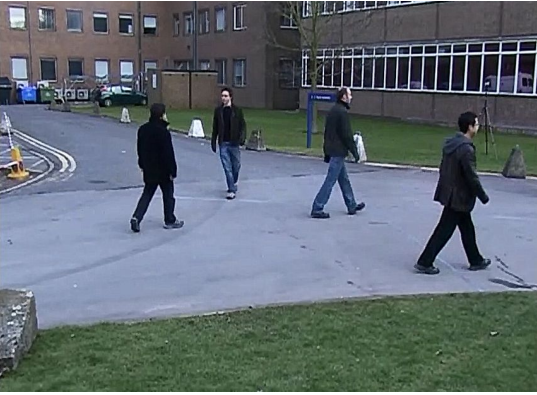
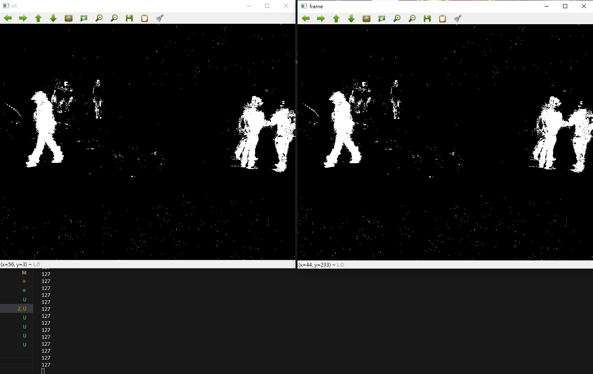
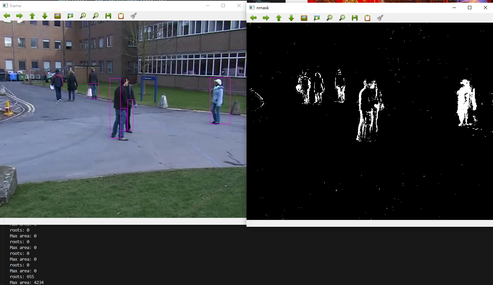
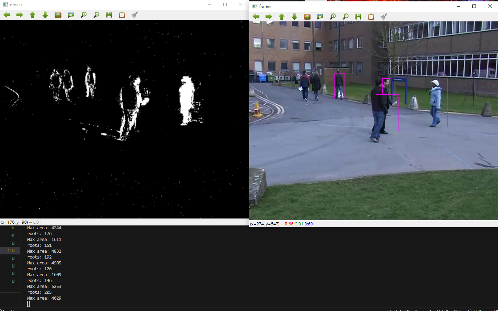

# Lab03
## 1. Back ground subtraction
- Original Video
    
- Back ground subtraction
    
```
%python lab3.py
```

```
mermaid
graph TD;
Background subtrction-->Set Threshold;
Set Threshold-->Connected component;
Connected component-->Label the foreground;
```

## 2. Label the human in the video
- Normal
    

It is just a normal version.
```
%python lab3_a_normal.py
```
- Apply Gaussian Blur filter
    

I found that applying Gaussian Blur filter make the label be more precise.
```
%python lab3_b.py
```