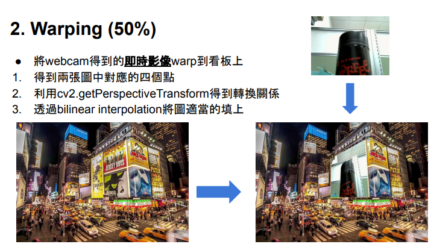

# Lab04
## Camera Calibration
- laptop calibratin files:
```
/laptop_camfile
```
- iphone camera files:
```
/phone_cal
```
- web camera files:
```
/web_cam_cal
```
First, run ```take_pics.py``` to take pictures by laptop camera or web camera.
That's depends on the parameter ```cap = cv2.VideoCapture(%i)```.
If ```%i == 0```, it will use laptop camera if it exists.
Otherwise, it will use web camera.

Then, run ```lab_4_1.py``` to calculate the camera parameter by the pictures taken before.

After that, run ```lab4_2.py``` to get the camera coefficency and use bilinear interpolation to warp the real-time video frame into the other picture.


