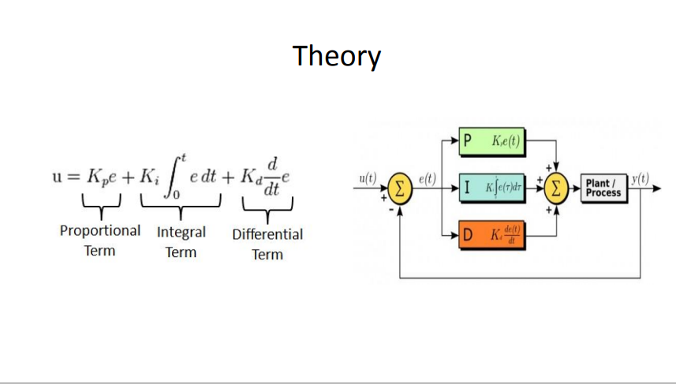

# Lab06
## 1. Trace Moving AR Marker
- Tello EDU control API
https://djitellopy.readthedocs.io/en/latest/
    * Installtion by
    ```
    pip install djitellopy
    ```
    or
    ```
    pip3 install djitellopy
    ```
### I. Modify /lab5_1.py
```
#import tello
form djitellopy import Tello
```
```
#drone = tello.Tello('', 8889)
drone.streamon()
drone = Tello()
drone.connect()
```
```
#frame = drone.read()
#frame = cv2.cvtColor(frame, cv2.COLOR_RGB2BGR)
frame = drone.get_frame_read()
frame = frame.frame
```
* Speed control
```
send_rc_control(self, left_right_velocity, forward_backward_velocity, up_down_velocity, yaw_velocity)
```
* Move control (specified distance)
```
move(self, direction, x)
rotate_clockwise(self, x)
rotate_counter_clockwise(self, x)
```
### II. implement PID

Implement in the following folder:
```
/pyimagesearch
```
### III. Trace AR Marker
* run ```lab06_final.py```